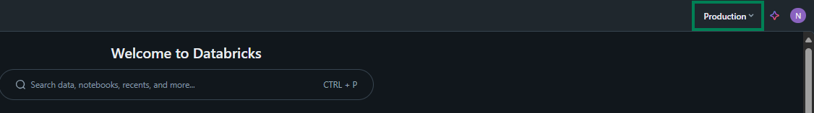
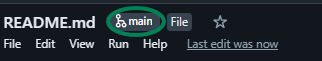

# Introduction 

This repository is designed to have work-along exercises that explore some of the functionality of Databricks. It also attempts to demonstrate some differences between using SQL and R through SSMS / RStudio, and using them on DataBricks. It also explores the different working spaces, storage spaces, etc. that are available for use on DataBricks.

This repository is designed to be run in the 'Production' environment of DataBricks within the Department for Education. During the onboarding process you should have been sent an email from the ADAPT team with a link to the Production environment. The repository can be utilised outside of the Department of Education as a Databricks learning tool, however there would be some steps required before this were possible (see 'Open Data Sources' section below).

_**Note:** This won't actually say 'Production'. It will instead appear as a code of letters and numbers, but for the purposes of this tutorial it is presented as 'Production'._

There are 4 environments in total; Production, Pre-production, Test, and Dev. The Production environment is the only environment on which sensitive data should be kept. As such the majority of analytical work will take place on this environment. 

Each environment looks the same apart from the name in the top right corner, however they are not connected to each other and data, files and code stored on one environment is not accessible from others. You may not have access to all of these environments, that is not a problem as long as you have access to the Production environment.

As the name in the top right is the only way to identify which environment you are on it can be helpful to create bookmarks in your browser titled with the respective environment name.

# Pre-requisites

To use this repository you will need:
- Access to the Databricks Production environment
- Within Databricks production you will need
   - A modelling area or catalog for you or your team with read/write/create permission
   - A SQL warehouse that is accessible for you or your team

These should all be taken care of by the ADA team when you are onboarded, however if you notice anything missing you should contact the ADA team to resolve it using [ADAPTTeam@education.gov.uk](mailto:ADAPTTeam@education.gov.uk).

## Recommendations

Databricks has a few new concepts that it helps to understand a bit about before use. These are covered briefly in the [Databricks fundamentals](https://dfe-analytical-services.github.io/analysts-guide/ADA/databricks_fundamentals.html) page in the [Analysts' Guide](https://dfe-analytical-services.github.io/analysts-guide/). Reading through this will help you navigate the platform while working through this repository.

For the exercises that are in the folder `01 - SQL Editor` the use of dual monitors is recommended as there is some copying and pasting between different Databricks pages. This is not required but will make the experience easier.

# Getting Started

## Create compute on Databricks 
To begin the exercises you will first need to setup up a personal cluster from the 'Compute' page in the left hand sidebar of the Databricks web page.

In order to access data and run code you need to set up a compute resource. A compute resource provides processing power and memory to pick up and manipulate the data. There are several types of compute resource available which are displayed in the table below. For this repositority you will need a 'SQL warehouse' (should be provided on onboarding) and a 'Personal cluster'.

Instructions on setting up a personal cluster are provided under the table below.

| Compute type | Description |
| ------------ | ----------- |
| SQL Warehouse | Can be used by multiple users, can use SQL commands only; best to use if you’re only querying data from Databricks using SQL |
| Personal cluster | Only used by a single user, supports R, SQL, python and scala; best to use if you require languages other than SQL. |
| Shared cluster | Can be used by multiple users, supports SQL, python and scala but not R |

1. Click 'Compute'
2. Press the 'Create with DfE Personal Compute' button
3. Switch the 'Node type' to 'Large 28GB 8-core node'
4. Click the 'Create compute' button at the bottom. This will start your cluster. Your cluster may take several minutes to start up.

Databricks charges based on the usage of compute, so if you finish work on Databricks it is good practice to terminate it when you're done to save money for the Department. As a precaution against running up unnecessary charges your personal cluster is set to terminate after 1 hour of inactivity. 

Once you have a cluster started you can begin working through the numbered folders sequentially. Each folder will have a README or numbered notebooks describing what the exercise is.

## Clone this repository to Databricks

In order to access this repository from the Databricks environment you'll need to clone this repo into your workspace using the following steps within Databricks:

1. Click the 'Workspace' option in the left hand side bar
2. Within your 'Home' directory click the blue 'Create' button and select 'Git folder'
3. In the 'Create Git folder' pop-up window 
   1. enter the URL for this repo into the 'Git repository URL' box, then ensure the 'Git provider' field is set to 'GitHub'
   2. The 'Git folder name' will auto-populate with the name of the repo, you can leave this as-is or change it if you wish
   3. Click the blue 'Create Git Folder' button
   4. You can now close GitHub and open the repository in Databricks to work through the exercises in order
  
## Begin the exercises

Start the exercises from folder `01 - SQL Editor`, beginning with the README in that folder, then following the files in numerical order.

Be sure to read and follow the instructions carefully as you are running through the code to ensure you understand what is happening.

From folder `02 - Notebooks` all the exercises are stored in notebooks in sequential order.

# Open Data Sources

To ensure this repository is generalisable the data used throughout is open data sourced from Kaggle. The specific datasets are listed below:

 - [Air BnB Open Data - Kaggle](https://www.kaggle.com/datasets/arianazmoudeh/airbnbopendata)
 - [COVID-19 dataset - Kaggle](https://www.kaggle.com/datasets/georgesaavedra/covid19-dataset)
 - [IMDB Datasets - Kaggle](https://www.kaggle.com/datasets/kunwarakash/imdbdatasets)
 - [Steam Games, Reviews, and Rankings - Kaggle](https://www.kaggle.com/datasets/mohamedtarek01234/steam-games-reviews-and-rankings)

These are stored in a Databricks catalog within the Production environment in a data catalog specifically designed to provide a sandbox of open data for analysts to practice manipulating in Databricks. By default any user of the environment is granted read-only access to the data.

The exception to this is the AirBNB dataset which is used as an example of importing data and is included in the respository folder `resources` titled `Airbnb_Open_Data.csv`. 

Each dataset that is stored in the training catalog is kept in it's own schema (`covid`, `imdb`, `steam` respectively). If you to want to use this training repository on another environment you will need to download these datasets, import them into a catalog in the following structure, and replace the hardcoded catalog name `catalog_40_copper_analyst_training` used in queries throughout the repository.

 - _Catalog name_ (catalog)
      - covid (schema)
         - covid_data (table)
      - imdb (schema)
         - name_basics (table)
         - title_akas (table)
         - title_basics (table)
         - title_crew (table)
         - title_episode (table)
         - title_principles (table)
         - title_ratings (table)
      - steam (schema)
         - games_descriptions (table)
         - games_ranking (table)
         - steam_game_reviews (table)

# Contribute
If you want to add lessons to this repository you should create a new branch by clicking the git button in the top left corner of this notebook. It will always have the title of the branch you are on, so presuming you just cloned this repo it will currently say 'main'.

This will allow you to create a new branch where you can add a new folder for the exercise you want to contribute. Once you have completed writing and testing it, you can raise a pull request on the GitHub repository [`databricks_code_learn`](https://github.com/dfe-analytical-services/databricks_code_learn.git).

Exercises should focus on completing a single process within the databricks environment using the open data sources above where possible. 

Nothing pushed to the repository should not contain any sensitive data including URLs of organisational environments, services or data, or personally identifiable information of any kind. This extends to images and screenshots within the repository as well.

Code should be portable, meaning that no changes to the code should have to be made by a user to successfully run through the exercises. Where values may be different between users _widgets_ or other methods of parameterisation should be used.